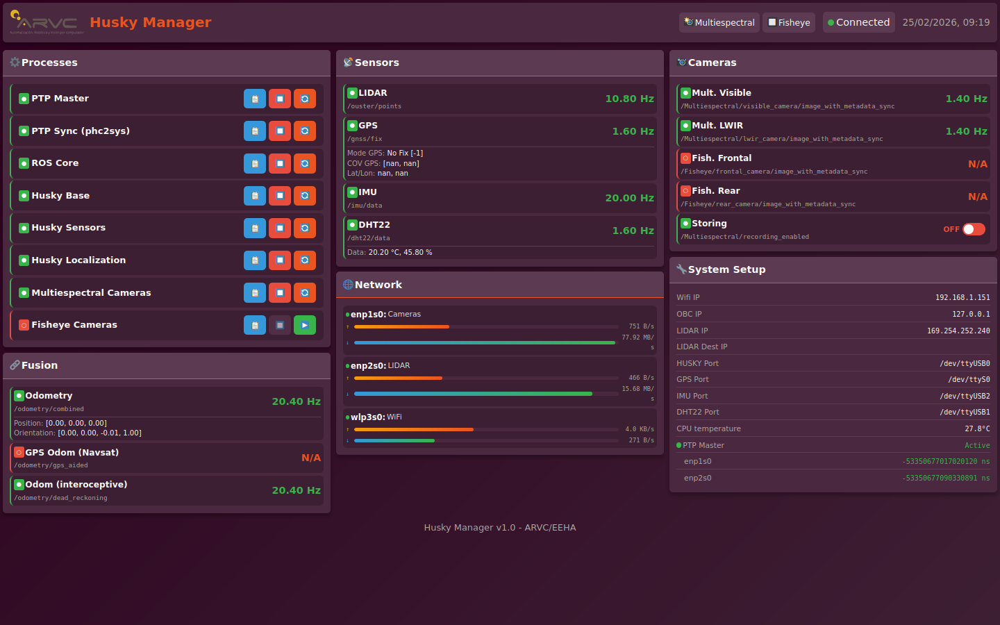
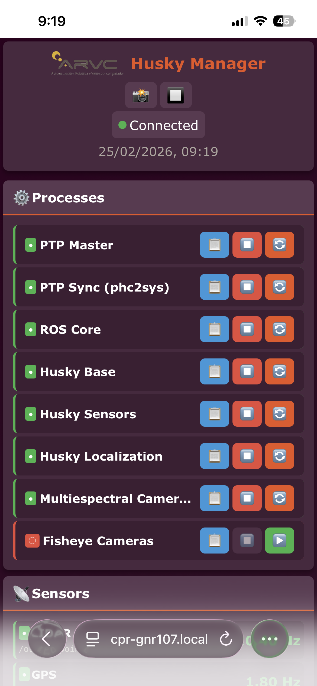
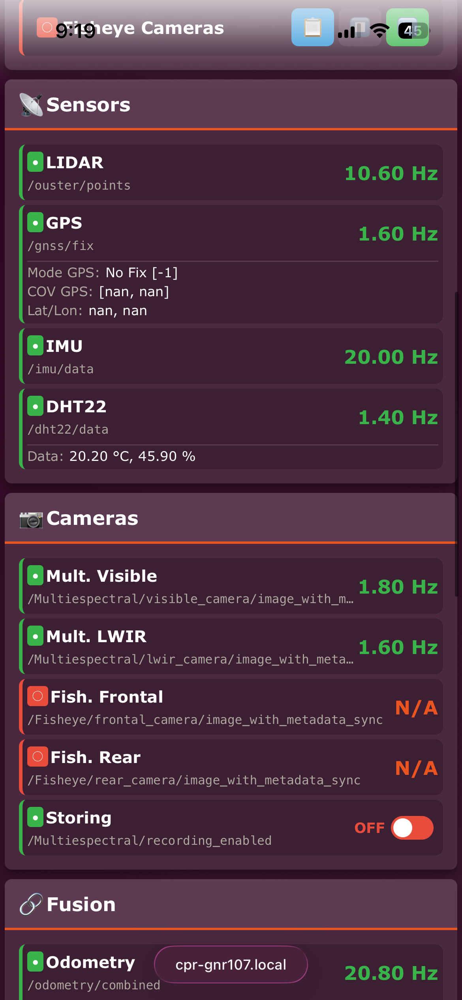
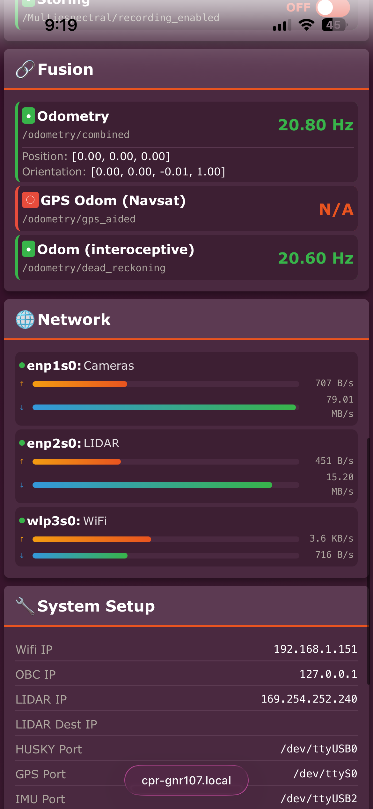

# Husky Manager

ROS package for managing and monitoring the Clearpath Husky UGV (cpr-gnr107). Provides a web dashboard for real-time process/sensor monitoring, launch files for all subsystems, and a terminal-based sensor checker.

## Web Dashboard

Flask web application (port 5050) for monitoring and controlling all robot subsystems from any device on the network.

<p align="center">
  
  
  
  
</p>

**Features:**
- **Process management** — view status, restart/stop 8 systemd services (PTP, roscore, husky_base, sensors, localization, cameras)
- **Sensor monitoring** — live frequency for LIDAR, GPS (with mode, covariance, lat/lon), IMU, DHT22 (temp/humidity)
- **Camera monitoring** — store rate for visible, LWIR, fisheye cameras + recording toggle
- **Fusion status** — odometry (combined, GPS-aided, interoceptive) with position/orientation
- **Sub-GUI links** — quick access to multiespectral (5051) and fisheye (5052) camera GUIs
- **Responsive** — desktop cards layout or vertical scroll on mobile

### Usage

```bash
# Auto-started via systemd
systemctl start husky_web_manager.service

# Or manually
roslaunch husky_manager web_manager.launch port:=5050
```

Access at `http://<HUSKY_IP>:5050/manager`

### Sudoers setup (required for service restart)

```bash
sudo cp src/web_manager/sudoers.d/husky-manager /etc/sudoers.d/husky-manager
sudo chmod 440 /etc/sudoers.d/husky-manager
sudo visudo -c  # verify syntax
```

## Launch Files

| Launch | Description |
|--------|-------------|
| `sensors_manager.launch` | UM7 IMU, Ouster LIDAR (1024×10, PTP), throttled pointcloud + image3D, NMEA GPS, DHT22 |
| `localization_manager.launch` | Dual EKF (`robot_localization`): dead reckoning + map-frame fused, plus NavSat GPS→odom transform |
| `fisheye_cameras.launch` | Two Basler fisheye cameras (frontal + rear) under `/Fisheye` namespace |
| `nav.launch` | `move_base` with DWA local planner, NavFn global, costmap configs |
| `cartographer_husky.launch` | Google Cartographer SLAM |
| `tf_from_urdf.launch` | Load Husky URDF + `robot_state_publisher` |
| `check.launch` | Terminal sensor checker (`check_sensors.py`) — live frequency table |
| `web_manager.launch` | Web dashboard node |

## Nodes

| Node | Description |
|------|-------------|
| `web_manager_node.py` | Flask web server + `HuskyMonitor` (ROS topic monitor + systemd process monitor) |
| `check_sensors.py` | Subscribes to all sensor topics, prints live table with `tabulate`, writes status to `/tmp/husky_sensor_status.txt` (consumed by Conky) |
| `image3D.py` | Converts Ouster PointCloud2 to projected OpenCV image for visualization |

## Web Manager Architecture

```
src/web_manager/
├── app.py           # Flask app with REST API (/api/status, /api/processes, /api/topics)
├── config.py        # Topic groups, process definitions, GUI links
├── ros_monitor.py   # TopicMonitor + ProcessMonitor + HuskyMonitor
├── templates/
│   └── index.html   # Dashboard HTML (masonry card layout)
├── static/
│   ├── app.js       # Frontend polling logic
│   └── style.css    # Responsive CSS
└── sudoers.d/
    └── husky-manager  # NOPASSWD config for systemctl
```

## Configuration

### Sensor IPs (set by `test_utils/scripts/husky_private_functions.sh`)

| Device | Address |
|--------|---------|
| Ouster LIDAR | 169.254.252.240 (enp2s0) |
| Basler cameras | 192.168.4.5 / .7 / .8 (enp1s0) |
| GPS | /dev/ttyS0 (serial) |
| IMU | /dev/serial/by-id/... (USB) |
| WiFi AP | 192.168.1.151 (wlp3s0) |

### EKF Configuration

Two `robot_localization` EKF nodes:
- **`ekf_se_odom`** → `/odometry/dead_reckoning` — interoceptive only (wheel odom + IMU)
- **`ekf_se_map`** → `/odometry/combined` — full fusion (odom + IMU + GPS)

Plus `navsat_transform_node` converting GPS fixes to odometry frame → `/odometry/gps_aided`.

## Related Repositories

| Repository | Relation |
|------------|----------|
| [test_utils](https://github.com/enheragu/test_utils) | Shell environment, hardware IPs, F-key shortcuts, Conky desktop monitor, systemd service definitions |
| [multiespectral_acquire](https://github.com/enheragu/multiespectral_acquire) | Camera drivers and acquisition pipeline — the sub-GUIs on ports 5051/5052 linked from this dashboard |
